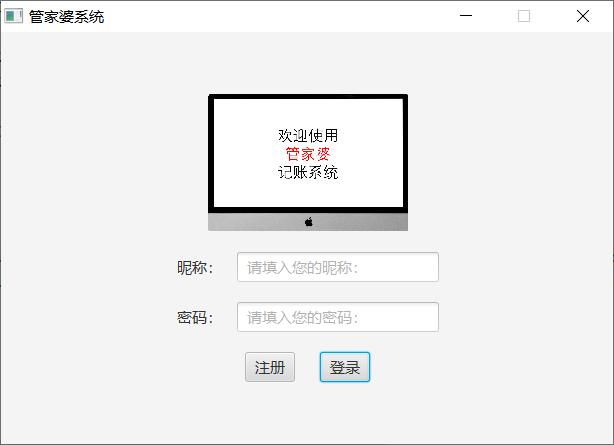
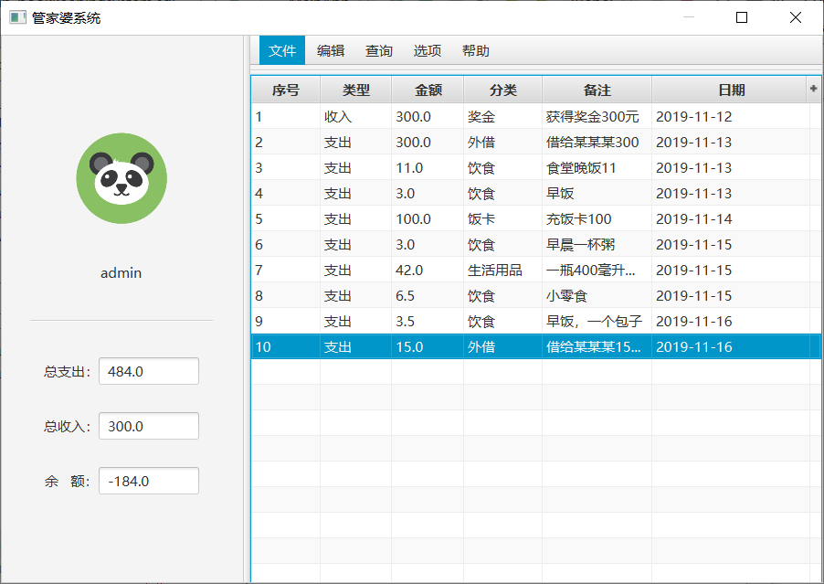
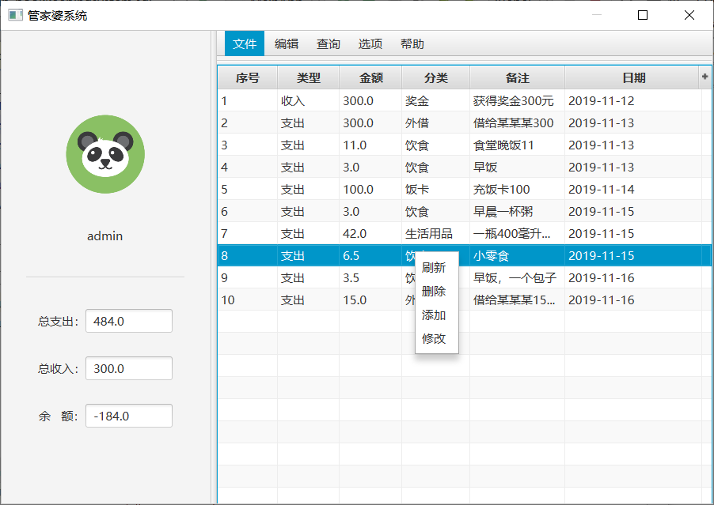
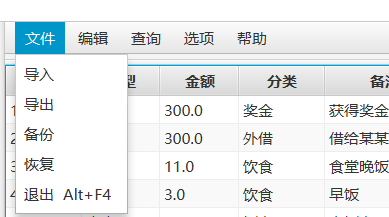
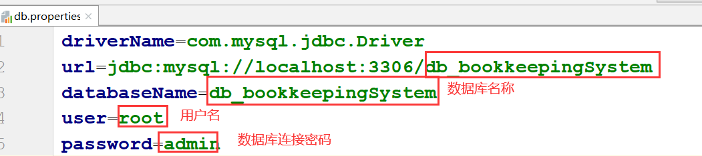

# AccountSystem

## 技术栈

- Java
- JavaFX
- MySQL
- poi（excel的导入导出）

## 项目介绍

管家婆记账系统，使用JavaFX实现数据展示。

运行截图如下：

- 登录

- 主界面

- 增删改查

- 文件

## 使用指导

第一步：下载下来项目后，修改数据库连接参数在src/properties/db.properties文件中。

第二步：运行MainApp.java中的main()方法。

第三步：可以先注册再登录，但没有数据，可以使用已有的测试账户（**用户名：admin；密码：admin**）进行登录，然后就可以使用了。

## 目录说明

- file

该目录下有两个文件夹，分别是jar和sql

其中jar是该项目使用所用到的第三方加包；而sql中是需要用到的SQL文件

- images

该目录下存放的是README.md文件中所需要用到的图片资源。

- src

该目录下是本项目的源代码。

## 参考链接

[Java实战之管家婆记账系统（1）——项目简述](http://mp.weixin.qq.com/s?__biz=MzU4MDc0NDI0NQ==&mid=2247485214&idx=1&sn=e9f0e848650a18467dfcadd87dec8127&chksm=fd536244ca24eb5268db7fa6e25483f2ee581cbe50043df12a00f737bad3f3f9a35282d46541&scene=21#wechat_redirect)

[Java实战之管家婆记账系统（2）——功能介绍](http://mp.weixin.qq.com/s?__biz=MzU4MDc0NDI0NQ==&mid=2247485217&idx=1&sn=891cb6b20baa103b40c59f3f1445d8ff&chksm=fd53627bca24eb6d62c1e218678462e379f45845d79375c2f028266ca61006d0354e7162325e&scene=21#wechat_redirect)

[Java实战之管家婆记账系统（3）——数据库表](http://mp.weixin.qq.com/s?__biz=MzU4MDc0NDI0NQ==&mid=2247485218&idx=1&sn=aa4a6ba06e4e22c254624c96b092fa08&chksm=fd536278ca24eb6e3f9cb8179da063a82e3bf3e01541e6c1204b4f416a8c6c5da3567fee9382&scene=21#wechat_redirect)

[Java实战之管家婆记账系统（4）——用户注册及登录功能实现](http://mp.weixin.qq.com/s?__biz=MzU4MDc0NDI0NQ==&mid=2247485220&idx=1&sn=8b26b28a056c0776ccafd61574d562f6&chksm=fd53627eca24eb686ed5ebd5520dc0bb8456d860aa6693e4bacb1b6315eddcf7196fae85b0ec&scene=21#wechat_redirect)

[Java实战之管家婆记账系统（5）——主界面及功能实现](http://mp.weixin.qq.com/s?__biz=MzU4MDc0NDI0NQ==&mid=2247485222&idx=1&sn=63b20f23694dfa85b087aa4b32e52826&chksm=fd53627cca24eb6af9a34a407ea1e6b4dd0472e5a5b0d11bb6349753195eba5b9b7166184ad9&scene=21#wechat_redirect)

[Java实战之管家婆记账系统（6）——导入和导出功能实现](http://mp.weixin.qq.com/s?__biz=MzU4MDc0NDI0NQ==&mid=2247485224&idx=1&sn=ad144defc6dd06f8ab477188cdb78d3a&chksm=fd536272ca24eb64777005461bac8f3744718264c73de5ba819a6b1a4a5940c09776ebe12807&scene=21#wechat_redirect)

[Java实战之管家婆记账系统（7）——备份、恢复和退出功能实现](http://mp.weixin.qq.com/s?__biz=MzU4MDc0NDI0NQ==&mid=2247485227&idx=1&sn=d7beaa83625eea3ae9afe1f6fb3111ad&chksm=fd536271ca24eb6708d6275b446adb94e1c4e12c745416fb55827c0797553d273118c6bc486e&scene=21#wechat_redirect)

[Java实战之管家婆记账系统（8）——添加账目界面及功能实现](http://mp.weixin.qq.com/s?__biz=MzU4MDc0NDI0NQ==&mid=2247485229&idx=1&sn=7f736a70a6851f9e7a5bad8e9034e651&chksm=fd536277ca24eb6102c40b4ae10dc107a70d964a7a2761fb478d82a2e8de321d375704ed06dc&scene=21#wechat_redirect)

[Java实战之管家婆记账系统（9）——删除账目界面及功能实现](http://mp.weixin.qq.com/s?__biz=MzU4MDc0NDI0NQ==&mid=2247485230&idx=1&sn=2cabc3c3ae01eddb37214866ecd2ee10&chksm=fd536274ca24eb627d00e303814eabda9d79105b19d6ecdf4daa39d11fd370b91f56e9c3b3a9&scene=21#wechat_redirect)

[Java实战之管家婆记账系统（10）——修改账目界面及功能实现](http://mp.weixin.qq.com/s?__biz=MzU4MDc0NDI0NQ==&mid=2247485231&idx=1&sn=9a05806290733597a0774d3607f3f670&chksm=fd536275ca24eb632b457620797d515280807b8feb11c4c6483f6232c67128b487ea32f99644&scene=21#wechat_redirect)

[Java实战之管家婆记账系统（11）——右键菜单实现刷新、增删改功能](http://mp.weixin.qq.com/s?__biz=MzU4MDc0NDI0NQ==&mid=2247485232&idx=1&sn=87a6bd3bee25f25b4c6ada6aafa38e41&chksm=fd53626aca24eb7c031423ef909452ae96e6395c4143351ea2634181f223ee11a98be6df5533&scene=21#wechat_redirect)

[Java实战之管家婆记账系统（12）——查询界面及功能实现](http://mp.weixin.qq.com/s?__biz=MzU4MDc0NDI0NQ==&mid=2247485233&idx=1&sn=672d44cc1b2659a84a0789be7602b4f9&chksm=fd53626bca24eb7d3269d530ef7cce2731718b1cc4721ddd96a13a8943ab29cf7653c3d444c4&scene=21#wechat_redirect)

[Java实战之管家婆记账系统（13）——按日期条件查询界面及功能实现](http://mp.weixin.qq.com/s?__biz=MzU4MDc0NDI0NQ==&mid=2247485234&idx=1&sn=3cd843cc8efeaf279630d64f61fdde01&chksm=fd536268ca24eb7e80c3bc3d21dddb709a1767844fa93f374a83d8f1f4438eeaf3fa86b53508&scene=21#wechat_redirect)

[Java实战之管家婆记账系统（14）——按分类条件查询界面及功能实现](http://mp.weixin.qq.com/s?__biz=MzU4MDc0NDI0NQ==&mid=2247485235&idx=1&sn=115fa8eb59c5db6f93b072accd2ce60f&chksm=fd536269ca24eb7fa93e84c4397850cb0f5701155b23f815623967136cc92bb448cab24a4a69&scene=21#wechat_redirect)

[Java实战之管家婆记账系统（15）——按备注条件查询界面及功能实现](http://mp.weixin.qq.com/s?__biz=MzU4MDc0NDI0NQ==&mid=2247485236&idx=1&sn=7d03a5f1983e7002047e8dc7dcd8e2c8&chksm=fd53626eca24eb783d8acec9973a2545c680b4b35c7f0f9f00f994a4631d693bcb2ed9c5e5d5&scene=21#wechat_redirect)

[Java实战之管家婆记账系统（16）——条形图展示数据界面及功能实现](http://mp.weixin.qq.com/s?__biz=MzU4MDc0NDI0NQ==&mid=2247485237&idx=1&sn=fc509a1c5ae2424f3799dcc465d1ffa1&chksm=fd53626fca24eb797af3719418024f438bacb3137ac46836897f6611104312f078997446629b&scene=21#wechat_redirect)

[Java实战之管家婆记账系统（17）——折线图展示数据界面及功能实现](http://mp.weixin.qq.com/s?__biz=MzU4MDc0NDI0NQ==&mid=2247485238&idx=1&sn=7f3cee37d4fa92e55618877b8da54240&chksm=fd53626cca24eb7a76eae918f214b7d0ba3269cfa52c91f1bfc32bd7455e5b0ef255464573f5&scene=21#wechat_redirect)

[Java实战之管家婆记账系统（18）——饼图展示数据界面及功能实现](http://mp.weixin.qq.com/s?__biz=MzU4MDc0NDI0NQ==&mid=2247485239&idx=1&sn=aa940c9074b5bc1953b28c876f7de3f2&chksm=fd53626dca24eb7bd193ab452f9d0f148c26c13186cfa068754a58dba47a697dacdaab9dac2a&scene=21#wechat_redirect)

[Java实战之管家婆记账系统（19）——报告界面及功能实现](http://mp.weixin.qq.com/s?__biz=MzU4MDc0NDI0NQ==&mid=2247485240&idx=1&sn=d6ee5e5fb6c14a89ef5ee5d2885ceb42&chksm=fd536262ca24eb74c3da16c59250b897f402e25d78788dc28620310d592039c7212629748371&scene=21#wechat_redirect)

[Java实战之管家婆记账系统（20）——添加分类界面及功能实现](http://mp.weixin.qq.com/s?__biz=MzU4MDc0NDI0NQ==&mid=2247485241&idx=1&sn=7d45906f3de8f64eb49fda83d14785a8&chksm=fd536263ca24eb75c8cc3667c2ece0f05c6f7b98101716f3caf9ecc0bebbb839c0d54d7865ff&scene=21#wechat_redirect)

[Java实战之管家婆记账系统（21）——用户信息界面及功能实现](http://mp.weixin.qq.com/s?__biz=MzU4MDc0NDI0NQ==&mid=2247485242&idx=1&sn=b0b72bd5d898a19172ec391ee58f5c3a&chksm=fd536260ca24eb76b0830e4776fcb89bb7f543687f028401121a2f60e33e5f53a1fcb4f11b21&scene=21#wechat_redirect)

[Java实战之管家婆记账系统（22）——实现修改软件主题皮肤功能](http://mp.weixin.qq.com/s?__biz=MzU4MDc0NDI0NQ==&mid=2247485243&idx=1&sn=b1c36ea17ef8ecaed4ece993310b712b&chksm=fd536261ca24eb77fe5b7ad7d87c45e265586d1cba041f9c9204325ac4f1fe7ae79d0f1d77f5&scene=21#wechat_redirect)

[Java实战之管家婆记账系统（23）——软件帮助说明界面及功能](http://mp.weixin.qq.com/s?__biz=MzU4MDc0NDI0NQ==&mid=2247485244&idx=1&sn=8d03ee8cc612d06be1219c237d335e50&chksm=fd536266ca24eb707877ed4657d805aa05d911c9a32272386ec88d29424d454a702ddc99bf06&scene=21#wechat_redirect)

[Java实战之管家婆记账系统（24）——项目总结](http://mp.weixin.qq.com/s?__biz=MzU4MDc0NDI0NQ==&mid=2247485245&idx=1&sn=a62cfb7e4377763a73b033b38275cec0&chksm=fd536267ca24eb712c53fa0c22a844945269f7304856920a191227e3a748a9212f8291d93aca&scene=21#wechat_redirect)